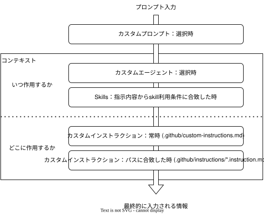

# カスタムインストラクション

## 概要

GitHub Copilotでは指示(プロンプト)を出す手続きを簡略化する手段や、AIが参照すべき背景や文脈を示す情報(コンテキスト)を予め定義する方法が提供されている。
代表的なものを以下に列挙する。

- カスタムプロンプト
- カスタムインストラクション
- カスタムエージェント
- Agent Skills

同じ指示の再現性を上げたり、プロジェクト共通の概念を都度与える手間を省いたり、もしくはAIが情報過多になり指示の無視やハレーションを起こしにくくするためにこれらの手段を活用すると良い。

## カスタムプロンプト

チャット欄で入力する指示を予め別ファイルに定義しておき、`/カスタムプロンプト名`で呼び出すことができる。  
コードのレビューやリファクタ指示、定型作業指示など、何度も同じ指示を出す必要がある場合に有用。

> .github/prompts/{カスタムプロンプト名}.prompt.md

```md
---
agent:動作するエージェント名を指定
description:プロンプトの説明
---

ここに内容を記述
```

> [!note]
> チャット後、この会話はカスタムプロンプトにしたいと感じた時は `/savePrompt` と入力してください。  
> あまり精度は期待できませんが、とりあえずカスタムプロンプトファイルを作成してくれます。

## カスタムインストラクション

プロンプト入力内容とは別に、AIが常に参照する情報を定義できる。

### 全体

リポジトリ内全体に有効なコンテキストを定義する。  
プロジェクトの共通ルールや背景、目的などを記述しておくと良い。

> .github/custom-instructions.md

> [!note]
> 以前はここに細かなルールを記述する傾向があったが、最近はファイルを分割してここには分割したファイルへのリンクのみ記載することが多い印象。常に必要でなければAgent Skillsへ記述を移すことも検討すべき。

### パス、対象指定

特定のディレクトリ以下、もしくは特定の拡張子やファイルに対してのみ有効なコンテキストを定義する。  
例えばテストファイルに対してはテストコード限定のルールを書く場合や、特定のディレクトリ固有のルールや背景を記述する場合などに有用。  
Copilotのレビュー機能とエージェント機能、それぞれにコンテキストを読ませるかどうかを指定することもできる。

> .github/instruction/{instruction-name}.instructions.md

```md
---
applyTo: "**/*.ts,**/*.tsx"
excludeAgent: "code-review"
---

ここに内容を記述
```

excludeAgent: には"cloud-agent"または"code-review"を指定できる。  
excludeAgent:を記述しない場合はレビュー時、エージェント動作時どちらでも読み込まれる。

## カスタムエージェント

ある特定の役割、例えば仕様調査担当、設計・実装担当、レビュー担当など、特定の役割に特化したエージェントを作ることができる。  
呼び出し時の`tools`を指定することで、回答はするけど編集はできないエージェントや、特定の拡張機能を使うための専用エージェントを作成できる。

> .github/agents/{agent-name}.agent.md

```md
---
name: ask-aws
description: AWS のサービス仕様やコスト情報、技術情報を調査するエージェントです。公式ドキュメントを一次情報として扱い、aws-knowledge-mcp-server を用いて検索・読解・関連ページ探索・リージョン可用性確認を行います。
tools: ["edit", "web", "aws-knowledge-mcp-server/aws___read_documentation", "aws-knowledge-mcp-server/aws___search_documentation"]
model: 利用するモデル
argument-hint: エージェント選択時のヒント表示
---

ここに内容を記述
```

## Agent Skills

特定の条件を満たした場合にのみ読み込まれるコンテキストを定義する。  
例えば `description` に「AWSに関する調査を行うときに使う」と記述しておけば、AIはAWSに関する質問があったときにこのコンテキストを参照するようになる。  
無駄にコンテキストを読まずに、必要に応じて参照することで回答の精度が上がったり、指示の無視やハレーションを減らすことができる。

> .github/skills/{スキル名}  
> .github/skills/{スキル名}/skill.md ※スキルの定義ファイル  
> .github/skills/{スキル名}/references/\*.md ※スキルの参考情報ファイル。スキル定義ファイルから参照される。  
> .github/skills/{スキル名}/scripts/\*.\* ※スキルの実行に必要なスクリプトファイル。スキル定義ファイルから参照される。

```md
---
name: { スキル名 }
description: AWSに関する調査（仕様確認、設計判断、ベストプラクティス確認、料金/制限の概算前提整理、エラー原因調査、リージョン提供状況確認、CDK/CloudFormation/CLI/SDKの参照）を行うときに使う。調査では必ず公式ドキュメントを一次情報として扱い、aws-knowledge-mcp-server（https://knowledge-mcp.global.api.aws）を用いて検索・読解・関連ページ探索・リージョン可用性確認を行う。
---

ここに内容を記述
```

## まとめ

AIに与えるコンテキストについて簡潔にまとめると以下のようになる。  
（厳密には指示の時系列などで読み込むタイミングは変わるので参考程度に）



プロジェクト内で共通で参照すべき情報、守って欲しいルールなどがあればカスタムインストラクションを活用して定義してください。  
リポジトリに登録し、プロジェクトメンバー皆で育てていくことで、プロジェクトの知識やルールがAIに蓄積され、より精度の高い回答が得られるようになります。  
より多くのメンバーで恩恵が受けられるように改善していきましょう。
