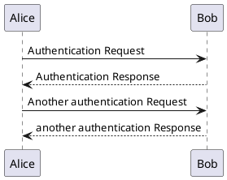
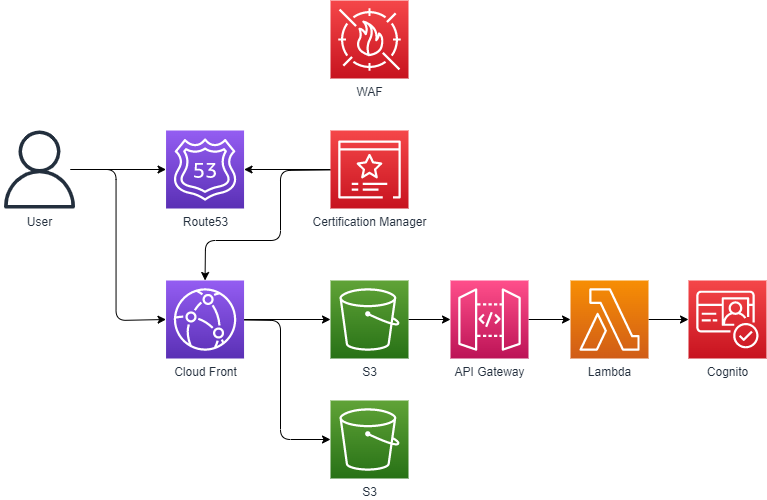

# mkdocs実験場

## PlantUML



## mermaid 


## Draw.io
### サンプル1


### サンプル2


## mkdocsに必要なもの

* 検索プラグイン
  ```
  pip install mkdocs-git-revision-date-plugin
  pip install mkdocs-git-revision-date-localized-plugin
  ```

* 半角スペースでネスト
  ```
  pip install mdx_truly_sane_lists
  ```

* Draw.io 
  ```
  pip install mkdocs-drawio-exporter
  ```
  https://fereria.github.io/reincarnation_tech/10_Programming/99_Documentation/05_mkdocs_drawio/  
  drawio.png 型にconvertしてmarkdownから参照する必要あり。

* PlantUML
  ```
  pip install plantuml-markdown
  ```
