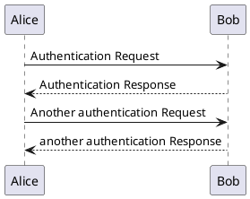

# mkdocs実験場

## PlantUML

```plantuml
@startuml
Alice -> Bob: Authentication Request
Bob --> Alice: Authentication Response

Alice -> Bob: Another authentication Request
Alice <-- Bob: another authentication Response
@enduml
```

## mermaid 

```mermaid
graph TD;
    A-->B;
    A-->C;
    B-->D;
    C-->D;
```

## Draw.io

